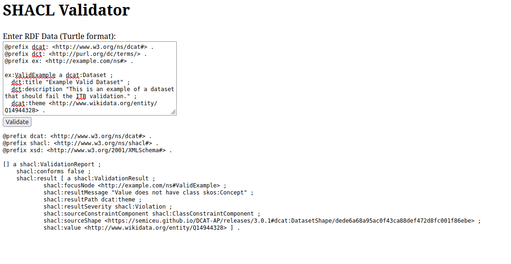

# shacl-api
A simple API to validate Turtle RDF against the HealthDCAT-AP shapes.

## Run the application in a Docker container:

1. Go to this directory in a terminal: `cd shacl-api`
2. Build the image: `docker build -t shacl-api .`
3. Run the tests inside the container: `docker run --rm -t shacl-api pytest ./tests`
4. Run the validation service in a web app: `docker run --rm -t -p 5000:5000 shacl-api:latest`
5. The API will be available at http://localhost:5000/
6. You submit turtle RDF data in the textbox, and click validate to make a POST call to the validation endpoint.
The result will show up below the textbox:

## Endpoints

### 1. Web Interface

Provides a simple HTML page with a form to manually input RDF data and view the validation results. It uses HTMX to asynchronously submit the form and render the results without reloading the page.

* **URL:** `/`
* **Method:** `GET`
* **Response Type:** `text/html`
* **Success Response:**
  * **Code:** `200 OK`
  * **Content:** An HTML page containing a text area for inputting Turtle data and a submit button.

---

### 2. Validate RDF Data

The core endpoint for validating RDF data. It accepts data in Turtle format either directly in the request body or as a form field.

* **URL:** `/validate`
* **Method:** `POST`

#### Accepted Content Types
The endpoint accepts two types of input, determined by the `Content-Type` header:

1. **`text/turtle`**
   * The request body should contain the raw, UTF-8 encoded RDF data in Turtle format.
2. **`application/x-www-form-urlencoded`**
   * Typically used by HTML forms (like the one provided in the web interface).
   * **Parameters:**
     * `rdf_data` (string, required): The RDF data in Turtle format to be validated.

#### Responses

* **Success:**
  * **Code:** `200 OK`
  * **Content-Type:** `text/turtle`
  * **Content:** The serialized validation report graph in Turtle format. This graph describes whether the input data conforms to the SHACL shapes and details any validation errors.

* **Client Error (Bad Request):**
  * **Code:** `400 Bad Request`
  * **Content-Type:** `text/plain`
  * **Content:** `Error: Unable to parse and validate the provided data.`
  * **Reason:** The provided RDF data was invalid (e.g., syntax error in the Turtle format) or an error occurred during the validation process.

* **Client Error (Unsupported Media Type):**
  * **Code:** `415 Unsupported Media Type`
  * **Content-Type:** `text/plain`
  * **Content:** `Error: unsupported Content-Type: '<content_type>'. Use text/turtle or application/x-www-form-urlencoded.`
  * **Reason:** The `Content-Type` header of the request was neither `text/turtle` nor `application/x-www-form-urlencoded`.
